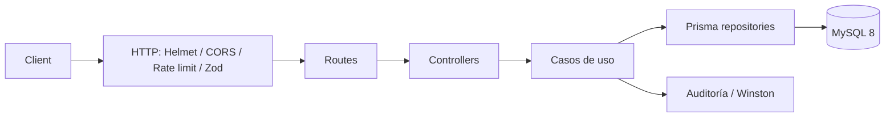
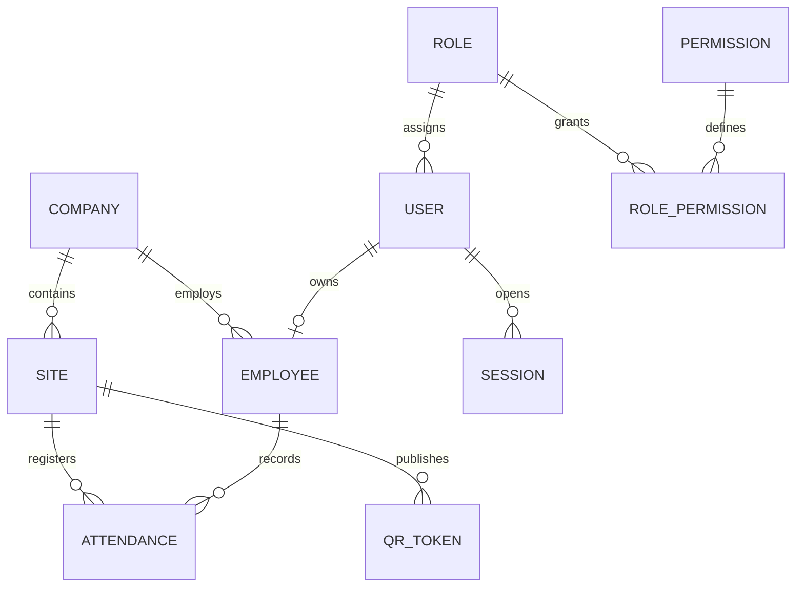

# MSA Asistencia API

API REST TypeScript para el control de asistencia empresarial de MSA Automotriz. Implementa Clean Architecture con casos de uso, Prisma/MySQL, JWT con rotación de sesiones, RBAC por permisos, auditoría, QR dinámico de un uso y geocercas GPS.

## Arquitectura

## Inicio local

1. Copie `.env.example` a `.env` y establezca secretos aleatorios de al menos 32 caracteres para ambos JWT.
2. Instale dependencias: `npm install`.
3. Cree la primera migración con `npm run prisma:migrate -- --name init`.
4. Genere el cliente y datos base: `npm run prisma:generate` y `npm run prisma:seed`.
5. Ejecute `npm run dev`.

La migración se genera desde `schema.prisma`; no existen consultas SQL manuales. El seed crea los roles Administrador, Gerente, Supervisor, Recursos Humanos y Empleado, más un administrador inicial `admin@msaautomotriz.com` con contraseña temporal `ChangeMe123!` que debe cambiarse de inmediato.

## Endpoints

Base: `/api/v1`. Los módulos CRUD son: `users`, `roles`, `permissions`, `companies`, `sites`, `departments`, `positions`, `schedules`, `employees`, `attendances`, `vacations`, `work-permissions`, `licenses`, `holidays`, `settings` y `notifications`.

Autenticación: `POST /auth/login`, `/auth/refresh`, `/auth/logout`, `/auth/change-password`, `GET /auth/sessions`, `DELETE /auth/sessions`.

Asistencia: `POST /qr/site/:siteId`, `POST /attendance/check`. La marcación valida QR vigente/no reutilizado, sede, distancia Haversine contra el radio de geocerca y almacena coordenadas, IP y agente de usuario. Un intento externo recibe `403` y el mensaje requerido.

Dashboard: `GET /dashboard/summary`. Swagger está disponible en `/api/docs`; todas las respuestas siguen `{ success, message, data }`.

## Docker y despliegue

Con `.env` configurado y `DATABASE_URL` apuntando a `mysql`, ejecute `docker compose up --build`. El contenedor aplica `prisma migrate deploy` antes de iniciar la aplicación. Para producción use secretos gestionados, TLS inverso, una cuenta MySQL sin privilegios de administración y rotación periódica de claves JWT.

## Calidad

`npm run build`, `npm run lint`, `npm test` y `npm run format:check` validan compilación, estilo, pruebas y formato. El plan de desarrollo se completa en este orden: infraestructura y RBAC, datos maestros, autenticación/sesiones, QR-geocerca, reportes asíncronos y observabilidad/despliegue.