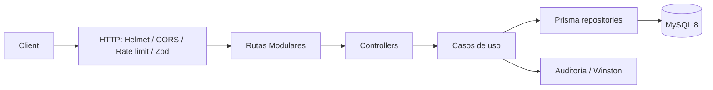
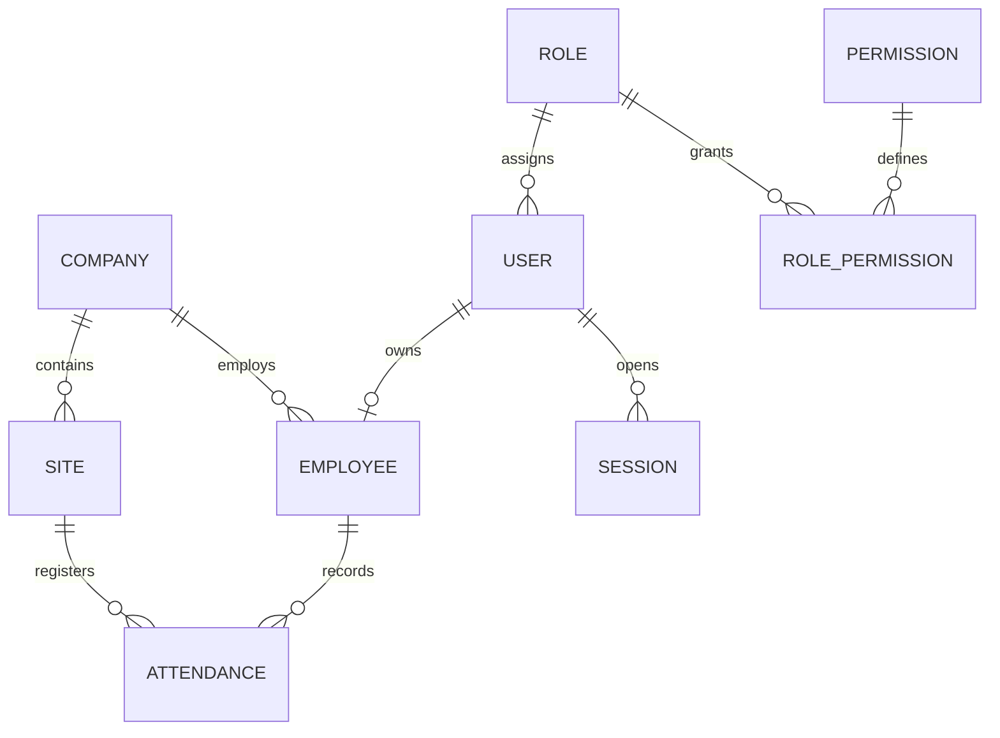

# MSA Asistencia API

API REST TypeScript para el control de asistencia empresarial de MSA Automotriz. Implementa Clean Architecture con casos de uso, Prisma/MySQL, JWT con rotación de sesiones, RBAC por permisos, auditoría y geocercas GPS.

## Arquitectura





## Estructura del Proyecto

```text
msa_asistencia/
├── prisma/                        # Esquema de datos y semillas
│   ├── migrations/                # Migraciones de base de datos MySQL
│   ├── schema.prisma              # Modelos de Prisma ORM
│   ├── seed.ts                    # Semillas de roles, usuarios y permisos iniciales
│   └── seed-employees.ts          # Semillas de personal demostrativo
├── public/                        # Frontend SPA & PWA
│   ├── css/                       # Sistema de diseño CSS modular
│   │   ├── tokens.css             # Tokens de diseño (colores MSA, sombras, radios)
│   │   ├── typography.css         # Tipografías (Plus Jakarta Sans, Inter) y escala
│   │   ├── base.css               # Resets, scrollbars y fondos dinámicos
│   │   ├── layout.css             # Sidebar, topbar (glassmorphism), workspace
│   │   ├── components.css         # Botones, formularios, KPI cards, tablas, modales
│   │   ├── views.css              # Estilos para dashboard, mapas, solicitudes
│   │   ├── animations.css         # Micro-animaciones y transiciones suaves
│   │   └── dark-theme.css         # Tema oscuro refinado con alto contraste
│   ├── images/                    # Logos e iconos de la aplicación
│   ├── vendor/                    # Librerías de terceros (Leaflet GPS Maps)
│   ├── app.css                    # Hoja de estilos principal (importador central)
│   ├── app.js                     # Lógica de cliente SPA, PWA, geolocalización y tema
│   ├── index.html                 # Shell HTML de la aplicación
│   ├── manifest.webmanifest       # Manifiesto para instalación PWA
│   └── service-worker.js          # Service Worker con caché offline (v6)
├── src/                           # Backend TypeScript (Clean Architecture)
│   ├── common/                    # Errores de aplicación y respuestas HTTP estándar
│   ├── config/                    # Variables de entorno y configuración
│   ├── controllers/               # Controladores CRUD genéricos
│   ├── database/                  # Instancia cliente de Prisma
│   ├── docs/                      # Especificación Swagger / OpenAPI
│   ├── middleware/                # Autenticación JWT, autorización RBAC, validación Zod
│   ├── routes/                    # Enrutadores modulares por dominio
│   │   ├── helpers.ts             # Utilidades compartidas (meta, auditoría, mountCrud)
│   │   ├── auth.routes.ts         # Login, tokens, recuperación y sesiones
│   │   ├── users.routes.ts        # Administración de usuarios y roles
│   │   ├── roles.routes.ts        # Permisos por rol
│   │   ├── requests.routes.ts     # Permisos, horas extra, vacaciones y licencias
│   │   ├── me.routes.ts           # Autoservicio de perfil, asistencia y avisos
│   │   ├── attendance.routes.ts   # Marcación GPS, estadísticas, calendario y offline
│   │   ├── reports.routes.ts      # Generación de reportes (CSV, XLSX, PDF)
│   │   ├── dashboard.routes.ts    # Métricas y actividad en vivo
│   │   ├── employees.routes.ts    # Provisión e importación de nómina Excel
│   │   ├── devices.routes.ts      # Autorización de dispositivos
│   │   ├── announcements.routes.ts# Comunicados corporativos
│   │   ├── audit.routes.ts        # Logs de auditoría
│   │   ├── companies.routes.ts    # Configuración e identidad corporativa
│   │   ├── backups.routes.ts      # Respaldos de base de datos
│   │   ├── system.routes.ts       # Mantenimiento y diagnóstico del sistema
│   │   ├── crud.routes.ts         # Mapeo de delegados CRUD
│   │   └── api.ts                 # Router principal agregador (/api/v1)
│   ├── use-cases/                 # Lógica de negocio y casos de uso
│   ├── utils/                     # Criptografía, logging (Winston) y parser User-Agent
│   ├── app.ts                     # Configuración de Express, middlewares y Swagger
│   └── server.ts                  # Punto de entrada y arranque del servidor
└── tests/                         # Suite de pruebas automatizadas (Vitest)
```

## Inicio local

1. Copie `.env.example` a `.env` y establezca secretos aleatorios de al menos 32 caracteres para ambos JWT.
2. Instale dependencias: `npm install`.
3. Aplique la migración inicial: `npm run prisma:deploy`.
4. Genere el cliente y datos base: `npm run prisma:generate` y `npm run prisma:seed`.
5. Ejecute `npm run dev`.

La migración se genera desde `schema.prisma`; no existen consultas SQL manuales. El seed crea los roles Administrador, Gerente, Supervisor, Recursos Humanos y Empleado, más un administrador inicial `admin@msaautomotriz.com` con contraseña temporal `ChangeMe123!` que debe cambiarse de inmediato.

La interfaz web se abre en `http://localhost:3000/`. Incluye inicio de sesión, dashboard, solicitudes, organización, asistencia con geocerca, reportes, auditoría, respaldos, usuarios, roles/permisos, sesiones y selector de tema claro/oscuro. También se puede instalar como PWA para conservar el shell y la cola de asistencia offline. Swagger continúa disponible en `http://localhost:3000/api/docs`.

El logo de MSA se encuentra en `public/images/logo_msa.png` y la interfaz lo carga desde `/images/logo_msa.png`.

## Endpoints

Base: `/api/v1`. Los módulos CRUD son: `users`, `roles`, `permissions`, `companies`, `sites`, `departments`, `positions`, `schedules`, `employees`, `attendances`, `vacations`, `work-permissions`, `licenses`, `holidays`, `settings` y `notifications`.

Autenticación: `POST /auth/login` acepta `rememberMe`; `POST /auth/refresh`, `/auth/logout`, `/auth/change-password`; `POST /auth/recovery-questions`, `/auth/password-recovery/start` y `/auth/password-recovery/reset`; `GET /auth/sessions`, `DELETE /auth/sessions/:sessionId` y `DELETE /auth/sessions`. La cuenta se bloquea durante 15 minutos tras cinco intentos fallidos. Toda revocación de sesión invalida inmediatamente su token de acceso.

Usuarios y accesos: `GET|POST /users`, `GET|PUT|PATCH|DELETE /users/:id`, `PUT /users/:id/status`, `POST /users/:id/reset-password`, `PUT /users/:id/role`, `PUT /users/:id/permissions`, `GET|PUT /roles/:id/permissions`. Las operaciones no exponen hashes de contraseña y los cambios de rol o permisos cierran las sesiones afectadas.

Solicitudes: el empleado usa `POST|GET /requests/work-permissions` y `DELETE /requests/work-permissions/:id`, o `POST|GET /requests/overtime` y `DELETE /requests/overtime/:id`. Administración revisa mediante `PATCH /work-permissions/:id/review` y `PATCH /overtime-requests/:id/review` con `APPROVED` o `REJECTED`.

Asistencia: `POST /attendance/check`. La marcación valida sede, distancia Haversine contra el radio de geocerca y almacena coordenadas, IP y agente de usuario. Un intento externo recibe `403` y el mensaje requerido.

## Correo y respaldos

Las notificaciones siempre se registran dentro de la aplicación. Para habilitar además el envío SMTP, configure `SMTP_HOST`, `SMTP_PORT`, `SMTP_USER`, `SMTP_PASSWORD` y, opcionalmente, `SMTP_FROM`. Si faltan esas variables, el sistema sigue funcionando solo con avisos internos.

Los respaldos se pueden iniciar manualmente desde Configuración o programar por empresa. El servidor revisa las programaciones cada 30 segundos y ejecuta las diarias o semanales en la hora, día y zona horaria definidos. En Windows, los respaldos de base de datos usan `C:\xampp\mysql\bin\mysqldump.exe` por defecto; use `MYSQLDUMP_PATH` para cambiar esa ubicación.

Dashboard: `GET /dashboard/summary`, `/dashboard/present`, `/dashboard/absent`, `/dashboard/late` y `/dashboard/recent-activity`. El resumen calcula presencia, ausencias, tardanzas, horas trabajadas, horas extra aprobadas, indicadores y una tendencia de siete días desde las asistencias registradas. Swagger está disponible en `/api/docs`; todas las respuestas siguen `{ success, message, data }`.

## Docker y despliegue

Con `.env` configurado y `DATABASE_URL` apuntando a `mysql`, ejecute `docker compose up --build`. El contenedor aplica `prisma migrate deploy` antes de iniciar la aplicación. Para producción use secretos gestionados, TLS inverso, una cuenta MySQL sin privilegios de administración y rotación periódica de claves JWT.

## Calidad

`npm run build`, `npm run lint`, `npm test` y `npm run format:check` validan compilación, estilo, pruebas y formato. El plan de desarrollo se completa en este orden: infraestructura y RBAC, datos maestros, autenticación/sesiones, geocerca GPS, reportes asíncronos y observabilidad/despliegue.
