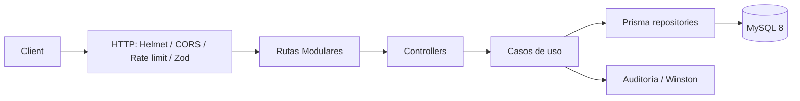
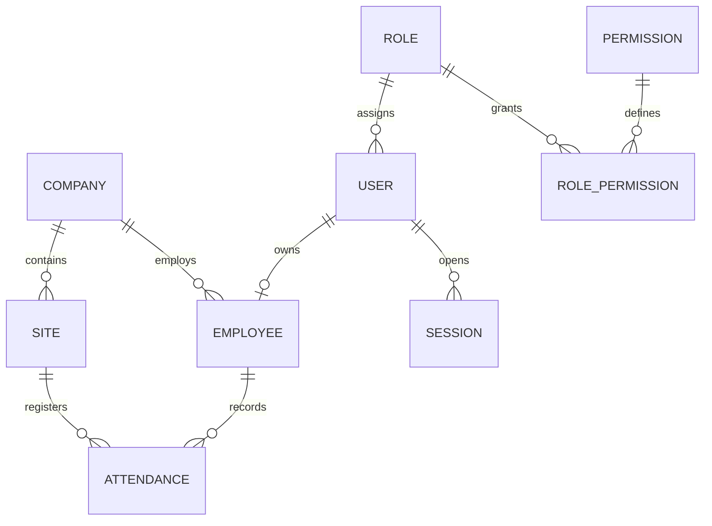

# MSA Asistencia API

API REST TypeScript para el control de asistencia empresarial de MSA Automotriz. Implementa Clean Architecture con casos de uso, Prisma/MySQL, JWT con rotación de sesiones, RBAC por permisos, auditoría y geocercas GPS.

## Arquitectura





## Estructura del Proyecto

```text
msa_asistencia/
├── prisma/                        # Esquema de datos y semillas
│   ├── migrations/                # Migraciones de base de datos MySQL
│   ├── schema.prisma              # Modelos de Prisma ORM
│   ├── seed.ts                    # Semillas de roles, usuarios y permisos iniciales
│   └── seed-employees.ts          # Semillas de personal demostrativo
├── public/                        # Frontend SPA & PWA
│   ├── css/                       # Sistema de diseño CSS modular
│   │   ├── tokens.css             # Tokens de diseño (colores MSA, sombras, radios)
│   │   ├── typography.css         # Tipografías (Plus Jakarta Sans, Inter) y escala
│   │   ├── base.css               # Resets, scrollbars y fondos dinámicos
│   │   ├── layout.css             # Sidebar, topbar (glassmorphism), workspace
│   │   ├── components.css         # Botones, formularios, KPI cards, tablas, modales
│   │   ├── views.css              # Estilos para dashboard, mapas, solicitudes
│   │   ├── animations.css         # Micro-animaciones y transiciones suaves
│   │   └── dark-theme.css         # Tema oscuro refinado con alto contraste
│   ├── images/                    # Logos e iconos de la aplicación
│   ├── vendor/                    # Librerías de terceros (Leaflet GPS Maps)
│   ├── app.css                    # Hoja de estilos principal (importador central)
│   ├── app.js                     # Lógica de cliente SPA, PWA, geolocalización y tema
│   ├── index.html                 # Shell HTML de la aplicación
│   ├── manifest.webmanifest       # Manifiesto para instalación PWA
│   └── service-worker.js          # Service Worker con caché offline (v6)
├── src/                           # Backend TypeScript (Clean Architecture)
│   ├── common/                    # Errores de aplicación y respuestas HTTP estándar
│   ├── config/                    # Variables de entorno y configuración
│   ├── controllers/               # Controladores CRUD genéricos
│   ├── database/                  # Instancia cliente de Prisma
│   ├── docs/                      # Especificación Swagger / OpenAPI
│   ├── middleware/                # Autenticación JWT, autorización RBAC, validación Zod
│   ├── routes/                    # Enrutadores modulares por dominio
│   │   ├── helpers.ts             # Utilidades compartidas (meta, auditoría, mountCrud)
│   │   ├── auth.routes.ts         # Login, tokens, recuperación y sesiones
│   │   ├── users.routes.ts        # Administración de usuarios y roles
│   │   ├── roles.routes.ts        # Permisos por rol
│   │   ├── requests.routes.ts     # Permisos, horas extra, vacaciones y licencias
│   │   ├── me.routes.ts           # Autoservicio de perfil, asistencia y avisos
│   │   ├── attendance.routes.ts   # Marcación GPS, estadísticas, calendario y offline
│   │   ├── reports.routes.ts      # Generación de reportes (CSV, XLSX, PDF)
│   │   ├── dashboard.routes.ts    # Métricas y actividad en vivo
│   │   ├── employees.routes.ts    # Provisión e importación de nómina Excel
│   │   ├── devices.routes.ts      # Autorización de dispositivos
│   │   ├── announcements.routes.ts# Comunicados corporativos
│   │   ├── audit.routes.ts        # Logs de auditoría
│   │   ├── companies.routes.ts    # Configuración e identidad corporativa
│   │   ├── backups.routes.ts      # Respaldos de base de datos
│   │   ├── system.routes.ts       # Mantenimiento y diagnóstico del sistema
│   │   ├── crud.routes.ts         # Mapeo de delegados CRUD
│   │   └── api.ts                 # Router principal agregador (/api/v1)
│   ├── use-cases/                 # Lógica de negocio y casos de uso
│   ├── utils/                     # Criptografía, logging (Winston) y parser User-Agent
│   ├── app.ts                     # Configuración de Express, middlewares y Swagger
│   └── server.ts                  # Punto de entrada y arranque del servidor
└── tests/                         # Suite de pruebas automatizadas (Vitest)
```

 